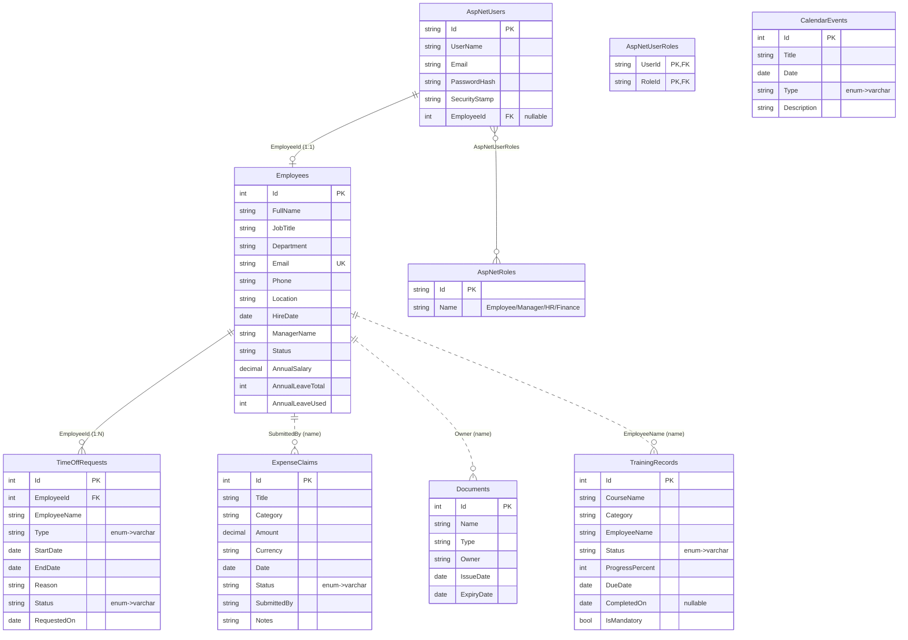

# HCP HR Portal — 데이터베이스 설계 (Database Design)

> .NET 8 Blazor Server · EF Core 8 · **MySQL** (Pomelo provider) · ASP.NET Core Identity

이 문서는 역할 기반(Role-based) HR 포털의 데이터베이스 스키마와 인증/권한 모델을 설명합니다.
스키마는 EF Core 마이그레이션(`Migrations/`)으로 코드화되어 있으며, 동일한 DDL이
[`docs/schema.sql`](schema.sql)(idempotent 스크립트)로도 산출되어 있습니다.

---

## 1. 개요

- **인증**: ASP.NET Core Identity (쿠키 기반). 모든 직원은 자신의 이메일/비밀번호로 로그인합니다.
- **권한**: 4개의 역할 `Employee` / `Manager` / `HR` / `Finance`.
- **로그인 → 대시보드**: 로그인 후 `/` 진입 시 사용자의 역할을 읽어 해당 역할 전용 대시보드로 리다이렉트합니다.
- **계정 ↔ 직원 연결**: 로그인 계정(`AspNetUsers`)은 직원 프로필(`Employees`)과 1:1로 연결됩니다(`AspNetUsers.EmployeeId`).

### 역할 → 대시보드 매핑

| 역할 (Role) | 랜딩 대시보드 | 접근 가능한 주요 화면 |
|---|---|---|
| `Employee` | `/employee-dashboard` | 내 프로필, 휴가, 근태, 경비, 문서, 교육, 성과, 복리후생, 급여명세 |
| `Manager`  | `/management-dashboard` | 결재(Approvals), 팀 캘린더, 성과, 교육, 리포트 |
| `HR`       | `/hr-dashboard` | 직원 레코드, 결재, 문서 만료, 계약, 교육, 리포트, 공지 |
| `Finance`  | `/finance-dashboard` | 경비, 송장(Invoices), 급여명세, 리포트 |

> 각 대시보드 페이지는 `[Authorize(Roles = ...)]`로 보호되며, 권한이 없으면 "접근 거부" 화면이 표시됩니다.
> 미로그인 상태로 보호 페이지에 접근하면 `/Account/Login`으로 리다이렉트됩니다.

---

## 2. ERD (Entity-Relationship Diagram)



> `||--o{` = FK로 강하게 연결된 관계, `||..o{` = 현재 이름 문자열로 느슨하게 연결된 관계(데모 데이터 호환을 위해 유지, 정규화 시 `EmployeeId` FK로 승격 권장).

---

## 3. 인증/권한 테이블 (ASP.NET Core Identity)

Identity가 표준으로 생성하는 테이블입니다. 핵심만 요약합니다.

| 테이블 | 용도 | 주요 컬럼 |
|---|---|---|
| `AspNetUsers` | 로그인 계정 | `Id`(PK), `UserName`, `NormalizedUserName`, `Email`, `PasswordHash`, `SecurityStamp`, **`EmployeeId`(FK→Employees, nullable)** |
| `AspNetRoles` | 역할 정의 | `Id`(PK), `Name`(`Employee`/`Manager`/`HR`/`Finance`) |
| `AspNetUserRoles` | 사용자-역할 (N:M) | `UserId`(FK), `RoleId`(FK) |
| `AspNetUserClaims` | 사용자 클레임 | `Id`, `UserId`(FK), `ClaimType`, `ClaimValue` |
| `AspNetUserLogins` | 외부 로그인 | `LoginProvider`, `ProviderKey`, `UserId`(FK) |
| `AspNetUserTokens` | 토큰 | `UserId`(FK), `LoginProvider`, `Name`, `Value` |
| `AspNetRoleClaims` | 역할 클레임 | `Id`, `RoleId`(FK), `ClaimType`, `ClaimValue` |

**확장 포인트**: `AspNetUsers.EmployeeId`는 커스텀 컬럼으로, 로그인 계정과 HR 직원 프로필을
1:1로 연결합니다. `OnDelete = SetNull`이므로 직원이 삭제돼도 계정은 남고 링크만 끊깁니다.

---

## 4. 도메인 테이블 상세

### 4.1 `Employees` — 직원 마스터
| 컬럼 | 타입 | 제약 | 설명 |
|---|---|---|---|
| `Id` | int | PK, AUTO_INCREMENT | |
| `FullName` | varchar(120) | NOT NULL | |
| `JobTitle` | varchar(120) | | 역할 산정에 사용(Manager/Director/Head/VP/Chief/Lead) |
| `Department` | varchar(80) | | 역할 산정에 사용(Human Resources/Finance) |
| `Email` | varchar(160) | NOT NULL, **UNIQUE** | 로그인 계정 매칭 키 |
| `Phone` | varchar(40) | | |
| `Location` | varchar(80) | | |
| `HireDate` | date | | |
| `ManagerName` | varchar(120) | | |
| `Status` | varchar(20) | | Active / On Leave 등 |
| `AnnualSalary` | decimal(12,2) | | |
| `AnnualLeaveTotal` | int | | |
| `AnnualLeaveUsed` | int | | |

> `AnnualLeaveRemaining`, `YearsOfService`, `Initials`는 **계산 속성**으로 `[NotMapped]` 처리되어 컬럼이 없습니다.

### 4.2 `TimeOffRequests` — 휴가 신청
| 컬럼 | 타입 | 제약 |
|---|---|---|
| `Id` | int | PK |
| `EmployeeId` | int | **FK → Employees.Id (ON DELETE CASCADE)**, INDEX |
| `EmployeeName` | varchar(120) | |
| `Type` | varchar(20) | enum: Annual/Sick/Unpaid/Parental/Compassionate |
| `StartDate` / `EndDate` | date | |
| `Reason` | varchar(400) | |
| `Status` | varchar(20) | enum: Pending/Approved/Rejected, INDEX |
| `RequestedOn` | date | |

### 4.3 `ExpenseClaims` — 경비 청구
| 컬럼 | 타입 | 비고 |
|---|---|---|
| `Id` | int | PK |
| `Title` | varchar(160) | |
| `Category` | varchar(40) | |
| `Amount` | decimal(12,2) | |
| `Currency` | varchar(8) | |
| `Date` | date | |
| `Status` | varchar(20) | enum: Draft/Submitted/Approved/Rejected/Reimbursed, INDEX |
| `SubmittedBy` | varchar(120) | 직원 FullName |
| `Notes` | varchar(400) | |

### 4.4 `Documents` — 문서/증빙
| 컬럼 | 타입 | 비고 |
|---|---|---|
| `Id` | int | PK |
| `Name` | varchar(120) | |
| `Type` | varchar(40) | Identity/Visa/Contract/Insurance/Certificate |
| `Owner` | varchar(120) | 직원 FullName |
| `IssueDate` / `ExpiryDate` | date | `ExpiryDate` INDEX |

> `DaysUntilExpiry`, `Status`(Valid/ExpiringSoon/Expired)는 `[NotMapped]` 계산 속성.

### 4.5 `TrainingRecords` — 교육 이수
| 컬럼 | 타입 | 비고 |
|---|---|---|
| `Id` | int | PK |
| `CourseName` | varchar(160) | |
| `Category` | varchar(40) | |
| `EmployeeName` | varchar(120) | 직원 FullName |
| `Status` | varchar(20) | enum: NotStarted/InProgress/Completed |
| `ProgressPercent` | int | |
| `DueDate` | date | |
| `CompletedOn` | date NULL | |
| `IsMandatory` | tinyint(1) | |

### 4.6 `CalendarEvents` — 캘린더 이벤트
| 컬럼 | 타입 | 비고 |
|---|---|---|
| `Id` | int | PK |
| `Title` | varchar(160) | |
| `Date` | date | INDEX |
| `Type` | varchar(20) | enum: Holiday/Meeting/Leave/Training/Deadline/Birthday |
| `Description` | varchar(400) | |

---

## 5. 역할 자동 부여 규칙 (시드)

`DbInitializer`는 직원별로 로그인 계정을 만들고 다음 규칙으로 역할을 부여합니다.

1. `Department == "Human Resources"` → **HR**
2. `Department == "Finance"` → **Finance**
3. `JobTitle`에 `Manager / Director / Head / VP / Chief / Lead` 포함 → **Manager**
4. 그 외 → **Employee**

### 데모 계정 (비밀번호 공통: `Passw0rd!`)
| 이메일 | 역할 | 랜딩 대시보드 |
|---|---|---|
| `sara.almansouri@hcp.example` | Employee | /employee-dashboard |
| `daniel.okafor@hcp.example` | Manager | /management-dashboard |
| `grace.chen@hcp.example` | HR | /hr-dashboard |
| `yusuf.demir@hcp.example` | Finance | /finance-dashboard |

> 시드 데이터의 12명 전원에게 계정이 생성됩니다(`elena.rossi`·`omar.haddad`·`aisha.khan` 등도 직책/부서에 따라 역할이 부여됨).

---

## 6. 실행 방법 (MySQL 연동)

1. **MySQL 준비** 후 빈 데이터베이스 생성:
   ```sql
   CREATE DATABASE hcp_hrportal CHARACTER SET utf8mb4 COLLATE utf8mb4_unicode_ci;
   ```
2. **연결 문자열** 확인/수정 — [`appsettings.json`](../appsettings.json)의 `ConnectionStrings:DefaultConnection`:
   ```
   Server=localhost;Port=3306;Database=hcp_hrportal;User=root;Password=root;TreatTinyAsBoolean=true;
   ```
3. **마이그레이션 적용** — 다음 중 하나:
   - 앱 실행 시 `DbInitializer`가 `Database.Migrate()`로 자동 적용 + 시드합니다(권장).
   - 수동: `dotnet ef database update`
   - SQL 직접 실행: [`docs/schema.sql`](schema.sql)를 MySQL에 실행(스키마만 생성, 시드는 앱 최초 실행 시).
4. **앱 실행**: `dotnet run` → 브라우저에서 `/Account/Login`으로 로그인.

### 마이그레이션 재생성/스크립트
```bash
dotnet ef migrations add <Name>          # 새 마이그레이션
dotnet ef migrations script --idempotent -o docs/schema.sql   # DDL 재산출
```

---

## 7. 설계 노트 / 향후 개선

- **느슨한 문자열 연결**: `ExpenseClaims.SubmittedBy`, `Documents.Owner`, `TrainingRecords.EmployeeName`는
  현재 직원 **이름 문자열**로 연결됩니다(기존 데모 UI 호환 목적). 정규화 시 각 테이블에
  `EmployeeId int FK`를 추가하고 이름 컬럼은 표시용으로만 두는 것을 권장합니다.
- **Department 정규화**: `Department`를 별도 `Departments` 테이블로 분리하면 부서 메타데이터/매니저 라인 관리가 쉬워집니다.
- **enum 저장**: 가독성을 위해 enum을 `varchar`로 저장합니다(쿼리/디버깅 용이). 저장공간이 중요하면 `int`로 변경 가능.
- **비밀번호 정책**: 데모를 위해 최소 6자/대문자·특수문자 불필요로 완화되어 있습니다(`Program.cs`). 운영 시 강화하세요.
